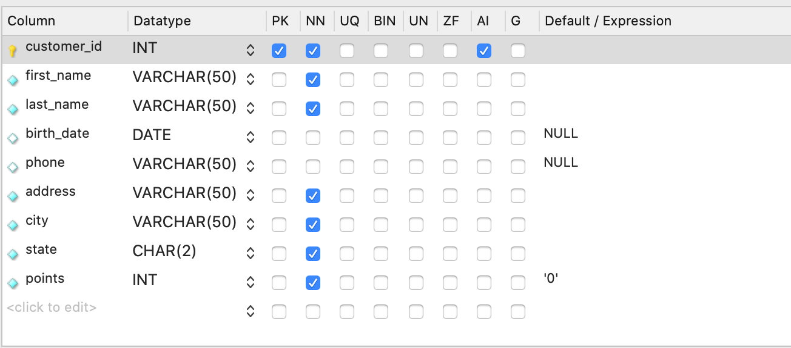

## Basics 

### Select 

```mysql
SELECT
  first_name,
  last_name,
  points,
  (points + 10) * 100 AS 'discount factor'
FROM customers;
```


```mysql
SELECT
distinct state
FROM customers;
```

Output :

```
'VA'
'CO'
'FL'
'TX'
'IL'
'TN'
'CA'
'GA'
```

```mysql
SELECT
*
FROM customers
WHERE birth_date > '1990-01-08'OR 
(points > 1000 AND state = 'VA');

SELECT
*
FROM customers
WHERE NOT (birth_date > '1990-01-08'
OR points > 1000)
```

### Like

```mysql
SELECT * 
FROM customers
WHERE last_name LIKE 'B____y'
```

% any number of characters

_ single character

### Regexp

```mysql
SELECT * 
FROM customers
WHERE last_name REGEXP 'field$'
```


```mysql
SELECT * 
FROM customers
WHERE last_name REGEXP '[a-h]e'
```

^ begining

$ end

| logical or

[abcd] 

[a-d] range

### NULL

```mysql
SELECT * 
FROM customers
WHERE phone IS NOT NULL
```

### ORDER BY

```mysql
SELECT * 
FROM customers
ORDER BY state, first_name DESC
```

```mysql
SELECT first_name, last_name
FROM customers
ORDER BY 1, 2
```

```mysql
SELECT * , quantity * unit_price AS total_price
FROM order_items
ORDER BY total_price DESC 
```

### LIMIT

```mysql
SELECT * 
FROM customers
LIMIT 0, 3
```

### INNER JOINS

```mysql
SELECT order_id, o.customer_id,first_name
FROM orders o   
JOIN customers c ON o.customer_id = c.customer_id
```

### Joining Across Databases

```mysql
SELECT * 
FROM order_items oi
JOIN sql_inventory.products p 
ON oi.product_id = p.product_id
```

### Self Joins

```mysql
USE sql_hr;

SELECT e.first_name, e.employee_id, m.first_name as manager
FROM employees e
JOIN employees m 
ON e.reports_to = m.employee_id
```

### Joining Multiple Tables

```mysql
USE sql_store;

SELECT o.order_id,
	   o.order_date,
       c.first_name,
       c.last_name,
       os.name AS status
FROM orders o
JOIN customers c 
ON o.customer_id = c.customer_id
JOIN order_statuses os
ON os.order_status_id = o.status
```

### Outer Joins

```mysql
SELECT c.customer_id,
       c.first_name,
       o.order_id
FROM orders o
RIGHT JOIN customers c 
ON o.customer_id = c.customer_id
ORDER BY c.customer_id
```

### Self Outer Joins

```mysql
USE sql_hr;

SELECT e.employee_id,
       e.first_name,
       m.first_name AS manager
FROM employees e
LEFT JOIN employees m
ON e.reports_to = m.employee_id
```

### The USING Clause

```mysql
SELECT *
FROM order_items oi
JOIN order_item_notes oin 
USING (order_id, product_id)
```

```mysql
USE sql_invoicing;
SELECT p.date,
	   c.name AS name,
	   p.amount,
       pm.name AS payment_method
FROM payments p
JOIN clients c USING (client_id)
JOIN payment_methods pm
ON pm.payment_method_id = p.payment_id
```

### Natural Joins

```mysql
SELECT o.order_id,
	   c.first_name
FROM  customers c
NATURAL JOIN orders o
```

### Cross Joins

```mysql
SELECT c.first_name,
	   p.name AS product
FROM customers c
CROSS JOIN products p
ORDER BY c.first_name
```

### UNION

```mysql
SELECT o.order_id,
	   order_date,
       'Active' AS status
FROM orders o
WHERE o.order_date >= '2019-01-01'
UNION
SELECT o.order_id,
	   order_date,
       'Archive' AS status
FROM orders o
WHERE o.order_date < '2019-01-01'
```

### Column Attributes



